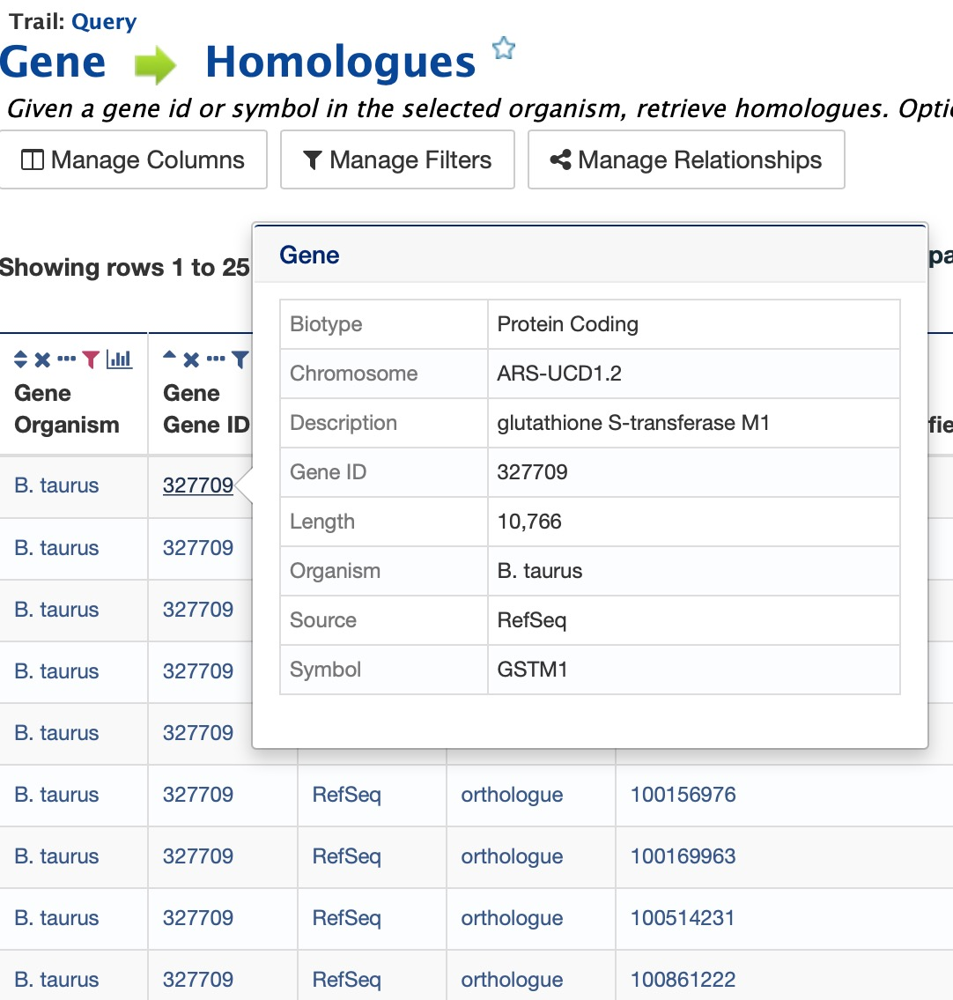
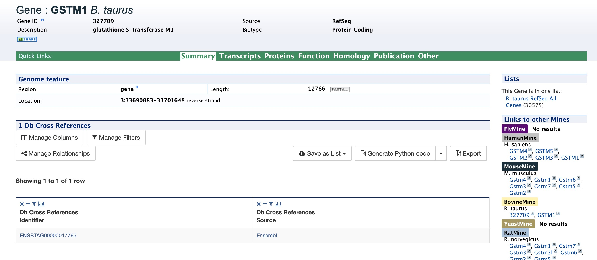
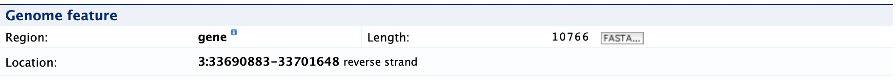
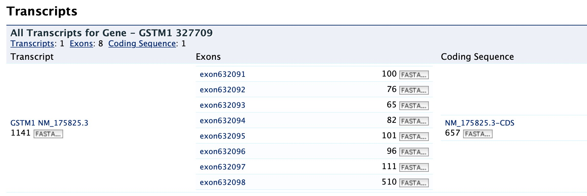
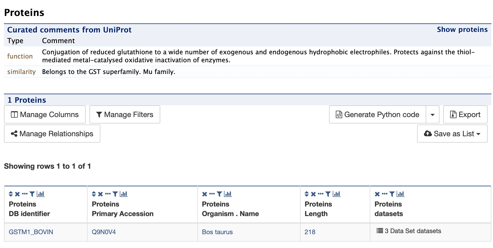
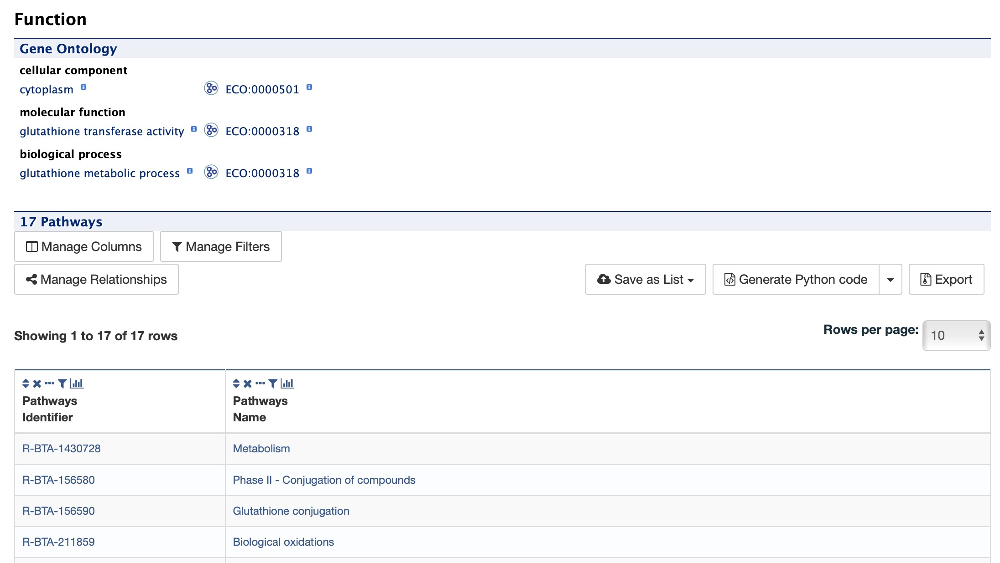
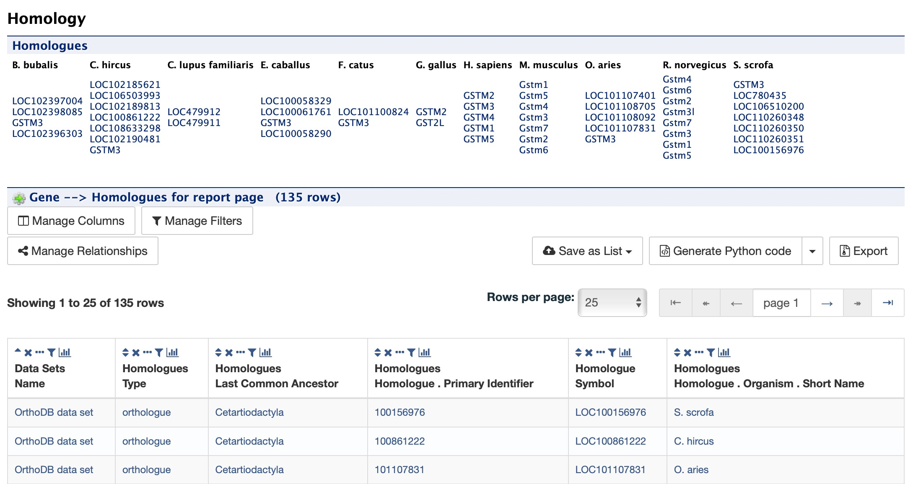
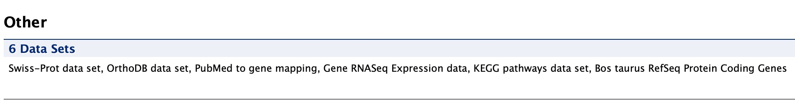

Report Pages
============

All objects in FAANGMine (e.g., gene, protein, transcript, publication) have report pages that can viewed after running a query.  It allows users to view all available information for that object while providing links to related objects.  As an example, we can revisit the templates example.  In the list of templates under the **Templates** tab on the FAANGMine home page, select Gene -> Homologues to query FAANGMine to retrieve all homologues for a given gene. Enter "GSTM1" into the the LOOKUP search box then click **Show Results**.  In the results table, note that every entry is contains a link.  You can mouse over any link to bring up a summary of that object. If we hover over the first Gene ID, we can see a summary box that includes 

   
   Summary for gene entry in query results table
   
   ..

Clicking on that same item will bring up its report page that includes a comprehensive for gene GSTM1.  The report page header shows the Gene ID and its Biotype, for this example, protein coding. The tabs at the top of the page in the Quick Links menu bar quickly bring you to the data listed. The column on the right side of the report page displays external links to other Mines and databases.

   
   Report page for protein-coding gene
   
   ..

The content of the report page is divided into categories based on the type of information provided for that particular object. Clicking on links within each category bring up more details about the objects of interest.

Summary
~~~~~~~
The **Summary** section near the top of the report provides information on the gene such as its length, chromosome location, and strand information.  Users can also get the complete FASTA sequence of the gene by clicking on the FASTA tab.

   

Transcripts
~~~~~~~~~~~
The **Transcripts** section contains information about the gene model, such as transcripts and exons. Links to FASTA files are included where applicable.

   

Proteins
~~~~~~~~
The **Proteins** section provides information about the protein product of the gene. The comments section gives a brief description about the protein along with the UniProt accession and links to any outside data sets.

   

Function
~~~~~~~~

The **Function** section displays Gene Ontology annotations for a gene. Annotations are divided into three categories:

* Cellular Component
* Molecular Function
* Biological Process

The GO terms are displayed along with the evidence code indicating how the annotations were derived.  A results with Pathway information is also displayed if applicable.

   

Homology
~~~~~~~~

The **Homology** section provides information for all homologues. The first portion displays a summarized view of the homologues reported in different organisms. The next portion provides more detailed information about the homologue, the type of homologue and from which dataset the information was obtained all displayed in a results table. 

   

Interactions
~~~~~~~~~~~~
The **Interactions** section provides interaction information. For GSTM1 there are no interaction information available but for genes that do have interaction information, a network is displayed showing all interactors for the current gene.

.. figure:: images/reports-page-interactions.jpg
   :width: 696
   :alt: Report page interactions section
   :figclass: align-center
   

Publications
~~~~~~~~~~~~
The **Publications** section displays a table of publications related to the gene with links to full citations.

.. figure:: images/reports-page-publications.jpg
   :width: 696
   :alt: Report page publication section
   :figclass: align-center
   

Other
~~~~~
This last section provides miscellaneous information that do not fit into any of the above categories.  This example lists protein coding annotations and their sources.

